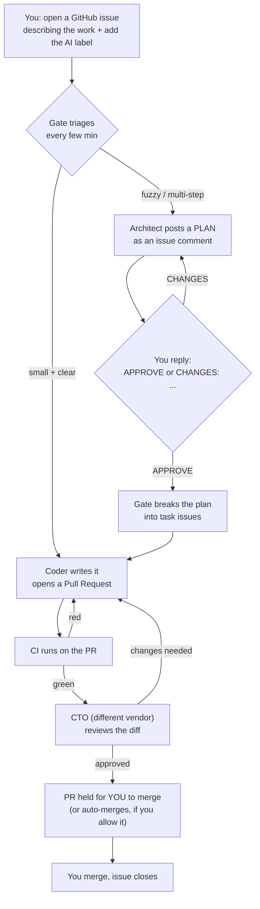

# Human Runbook — Max Agency

This is the **only** document you need to operate Max Agency. It is written for a human, in
order, with examples. If a step here is unclear or wrong, that is a bug in this runbook — fix it.

> **What Max Agency is, in one sentence.** You point it at a GitHub repo, open a normal issue
> describing what you want, add **one label (`AI`)**, and a small team of AI models plans it,
> writes it, reviews it across vendors, and opens a pull request for you to merge — on a
> schedule, with no babysitting.

Your entire job is three things: **onboard a repo once**, **open issues + add `AI`**, and
**reply to those issues** (`APPROVE` / `CHANGES:` / answer a question) and merge the PRs.

---

## The flow at a glance



**Who does what:** triage + plan-expansion = Codex (`gpt-5.4-mini`); coder = an OpenRouter
model via Hermes (per-project, e.g. `xiaomi/mimo-v2.5` for code, `openrouter/owl-alpha` for
prose); architect + CTO = Claude Opus. Cross-vendor review (Claude reviewing another vendor's
work) is deliberate.

---

## Part 1 — One-time machine setup (do this once per computer)

You only do this once, ever, on the Windows machine that will run the gate.

1. **Install the tools** and sign each one in. The authoritative checklist (with verify
   commands) is **[`SETUP.md`](SETUP.md)** — follow it. In short you need, on PATH and
   authenticated:
   - `git`, `python` (3.x), and `gh` (GitHub CLI) — `gh auth login`
   - `codex` (Codex CLI, OpenAI/ChatGPT login) — the orchestrator
   - `claude` (Claude CLI, Anthropic login) — architect + CTO
   - `wsl` with `hermes` installed inside WSL, and `gh` authed *inside WSL too* — the coder
2. **Get Max Agency onto the machine:** clone this repo somewhere stable, e.g.
   `C:\Users\<you>\Github_Projects\Max_Agency`. That folder is referred to below as
   **`<MaxAgency>`**.

You do **not** need to install anything per project. Part 1 is the whole machine setup.

---

## Part 2 — Onboard a project (one command)

This is the step that makes a repo manageable by Max Agency. Run it once per repo.

### 2.1 — Run the setup script

Open **PowerShell** and run (substitute your repo):

```powershell
powershell -ExecutionPolicy Bypass -File <MaxAgency>\scripts\setup.ps1 -Repo owner/repo -NoAutoMerge
```

Worked example (the repo we are onboarding now):

```powershell
powershell -ExecutionPolicy Bypass -File C:\Users\lobster\Github_Projects\Max_Agency\scripts\setup.ps1 -Repo Wagner-Maximiliano/Expat_Concierge -NoAutoMerge
```

> Use `-NoAutoMerge` for any **real / live** repo: the CTO can approve, but **every merge
> waits for you**. Drop it later, once you trust it, to let clean PRs merge themselves.

**What this one command does:**
1. Checks your CLIs are installed and signed in (warns if any are missing).
2. Creates the gate's label set on the repo (idempotent — safe to re-run).
3. Creates `Max_AgencyConfig.md` in the repo (where you pick the per-project models).
4. Registers **this project's own** hidden scheduled task — named
   `MaxAgencyGate-<owner>-<repo>` — that runs the gate every 5 minutes, plus a shared
   daily log-cleanup task.

**One task per project.** Onboarding a second repo creates a second task; both run side by
side. List them all with `Get-ScheduledTask -TaskName "MaxAgencyGate-*"`.

### 2.2 — Make sure the repo has a starting point

The coder builds on top of your repo's main branch. If the repo is **brand new and empty**,
give it a first commit (a `README.md` is enough) so the `main` branch exists. An existing repo
with any history already satisfies this.

### 2.3 — (Optional) Choose the per-project coder model

Open `Max_AgencyConfig.md` in the repo, set `GATE_CODER_MODEL` to suit the work (a code model
for software, a writing model for prose), then **commit + push**. The gate reads it each run.
Test a model before relying on it:

```powershell
python <MaxAgency>\gate\check_model.py coder --model <model-id>
```

That is onboarding done. The gate is now watching the repo and costs nothing until you add the
`AI` label to an issue.

---

## Part 3 — Daily use (the only things you ever do)

### 3.1 — Ask for work: open an issue + add `AI`

Open a normal GitHub issue describing what you want. Add the **`AI`** label. That label is the
on-switch (and the kill-switch — remove it to stop work on that issue).

- **Small, clear task** → goes straight to the coder, which opens a PR.
- **Fuzzy or multi-step** → the **architect** replies with a PLAN as a comment.

### 3.2 — Approve a plan (when the architect posts one)

Read the plan in the issue comments. Reply with a comment that starts with either:

- `APPROVE` — the gate turns the plan into task issues and the coder starts building.
- `CHANGES: <what to change>` — the architect revises the plan and re-posts. Repeat until happy.

> Only **your** comment counts, and only the latest one. The exact words matter: start the line
> with `APPROVE` or `CHANGES:`.

### 3.3 — Review and merge the PR

When the coder opens a PR, CI runs and then the CTO (a different vendor) reviews it. With
`-NoAutoMerge` the PR is **held for you** even after CTO approval. Look it over and click
**Merge**. The linked issue closes automatically.

That is the whole daily loop: **issue + `AI` → (approve plan) → merge PR**.

---

## Part 4 — Running several projects at once

Because each project has its own task (`MaxAgencyGate-<owner>-<repo>`) and its own run lock,
you can onboard as many repos as you like — they run independently and never block each other.

```powershell
powershell -ExecutionPolicy Bypass -File <MaxAgency>\scripts\setup.ps1 -Repo owner/project-a -NoAutoMerge
powershell -ExecutionPolicy Bypass -File <MaxAgency>\scripts\setup.ps1 -Repo owner/project-b -NoAutoMerge
Get-ScheduledTask -TaskName "MaxAgencyGate-*"     # see them all
```

Each project keeps its own models in its own `Max_AgencyConfig.md`.

---

## Part 5 — Manage, pause, troubleshoot

| I want to… | Do this |
|---|---|
| **Pause one project** | `Disable-ScheduledTask -TaskName "MaxAgencyGate-<owner>-<repo>"` |
| **Resume it** | `Enable-ScheduledTask -TaskName "MaxAgencyGate-<owner>-<repo>"` |
| **Stop one issue only** | remove the `AI` label from that issue |
| **See what the gate is doing** | read the newest file in `<MaxAgency>\runtime\logs\gate\*.jsonl` |
| **See exactly what an AI was told / replied** | read `<MaxAgency>\runtime\logs\transcripts\*.txt` |
| **Run a project's tick by hand (watch it live)** | `python <MaxAgency>\gate\gate.py --repo owner/repo --mode dispatch-enabled --scope-label AI --no-auto-merge` |
| **Remove a project entirely** | `Unregister-ScheduledTask -TaskName "MaxAgencyGate-<owner>-<repo>" -Confirm:$false` (the labels/config stay on the repo until you delete them) |

**Nothing happens unexpectedly:** the gate only ever touches issues that carry the `AI` label,
and with `-NoAutoMerge` it never merges without you.

---

## Teardown (undo everything on a machine)

```powershell
Get-ScheduledTask -TaskName "MaxAgencyGate-*" | Unregister-ScheduledTask -Confirm:$false
Unregister-ScheduledTask -TaskName "MaxAgencyLogCleanup" -Confirm:$false
```

That removes all the schedules. The repos themselves (labels, config, any merged work) are
untouched — Max Agency only ever added labels and opened PRs you approved.
